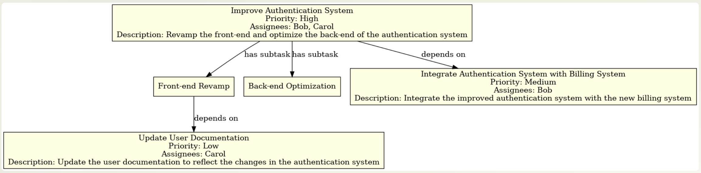

# Example: Extracting Action Items from Meeting Transcripts

In this guide, we'll walk through how to extract action items from meeting transcripts using OpenAI's API. This use case is essential for automating project management tasks, such as task assignment and priority setting.

!!! tips "Motivation"

    Significant amount of time is dedicated to meetings, where action items are generated as the actionable outcomes of these discussions. Automating the extraction of action items can save time and guarantee that no critical tasks are overlooked.

## Defining the Structures

We'll model a meeting transcript as a collection of **`Ticket`** objects, each representing an action item. Every **`Ticket`** can have multiple **`Subtask`** objects, representing smaller, manageable pieces of the main task.

```ts
import Instructor from "@/instructor"
import OpenAI from "openai"
import { z } from "zod"

const PrioritySchema = z.enum(["HIGH", "MEDIUM", "LOW"]);

const SubtaskSchema = z.object({
  id: z.number(),
  name: z.string(),
})

const TicketSchema = z.object({
  id: z.number(),
  name: z.string(),
  description: z.string(),
  priority: PrioritySchema,
  assignees: z.array(z.string()),
  subtasks: z.array(SubtaskSchema).optional(),
  dependencies: z.array(z.number()).optional()
})

const ActionItemsSchema = z.object({
  items: z.array(TicketSchema)
})

type ActionItems = z.infer<typeof ActionItemsSchema>
```

## Extracting Action Items

To extract action items from a meeting transcript, we use the **`extractActionItems`** function. It calls OpenAI's API, processes the text, and returns a set of action items modeled as **`ActionItems`**.

```ts
const oai = new OpenAI({
  apiKey: process.env.OPENAI_API_KEY ?? undefined,
  organization: process.env.OPENAI_ORG_ID ?? undefined
})

const client = Instructor({
  client: oai,
  mode: "FUNCTIONS",
})

const extractActionItems = async (data: string): Promise<ActionItems | undefined> => {
  const actionItems: ActionItems = await client.chat.completions.create({
    messages: [
      {
        "role": "system",
        "content": "The following is a transcript of a meeting...",
      },
      {
        "role": "user",
        "content": `Create the action items for the following transcript: ${data}`,
      },
    ],
    model: "gpt-4o",
    response_model: { schema: ActionItemsSchema },
    max_tokens: 1000,
    temperature: 0.0,
    max_retries: 2,
  })

  return actionItems || undefined
}
```

## Evaluation and Testing

To test the **`extractActionItems`** function, we provide it with a sample transcript, and then print the JSON representation of the extracted action items.

```ts
const actionItems = await extractActionItems(
`Alice: Hey team, we have several critical tasks we need to tackle for the upcoming release. First, we need to work on improving the authentication system. It's a top priority.

Bob: Got it, Alice. I can take the lead on the authentication improvements. Are there any specific areas you want me to focus on?

Alice: Good question, Bob. We need both a front-end revamp and back-end optimization. So basically, two sub-tasks.

Carol: I can help with the front-end part of the authentication system.

Bob: Great, Carol. I'll handle the back-end optimization then.

Alice: Perfect. Now, after the authentication system is improved, we have to integrate it with our new billing system. That's a medium priority task.

Carol: Is the new billing system already in place?

Alice: No, it's actually another task. So it's a dependency for the integration task. Bob, can you also handle the billing system?

Bob: Sure, but I'll need to complete the back-end optimization of the authentication system first, so it's dependent on that.

Alice: Understood. Lastly, we also need to update our user documentation to reflect all these changes. It's a low-priority task but still important.

Carol: I can take that on once the front-end changes for the authentication system are done. So, it would be dependent on that.

Alice: Sounds like a plan. Let's get these tasks modeled out and get started.`
)

console.log({ actionItems: JSON.stringify(actionItems) })
```

## Visualizing the tasks

In order to quickly visualize the data we used code interpreter to create a graphviz export of the json version of the ActionItems array.



```json
{
  "items": [
    {
      "id": 1,
      "name": "Improve Authentication System",
      "description": "Revamp the front-end and optimize the back-end of the authentication system",
      "priority": "High",
      "assignees": ["Bob", "Carol"],
      "subtasks": [
        {
          "id": 2,
          "name": "Front-end Revamp"
        },
        {
          "id": 3,
          "name": "Back-end Optimization"
        }
      ],
      "dependencies": []
    },
    {
      "id": 4,
      "name": "Integrate Authentication System with Billing System",
      "description": "Integrate the improved authentication system with the new billing system",
      "priority": "Medium",
      "assignees": ["Bob"],
      "subtasks": [],
      "dependencies": [1]
    },
    {
      "id": 5,
      "name": "Update User Documentation",
      "description": "Update the user documentation to reflect the changes in the authentication system",
      "priority": "Low",
      "assignees": ["Carol"],
      "subtasks": [],
      "dependencies": [2]
    }
  ]
}
```

In this example, the **`extractActionItems`** function successfully identifies and segments the action items, assigning them priorities, assignees, subtasks, and dependencies as discussed in the meeting.

By automating this process, you can ensure that important tasks and details are not lost in the sea of meeting minutes, making project management more efficient and effective.